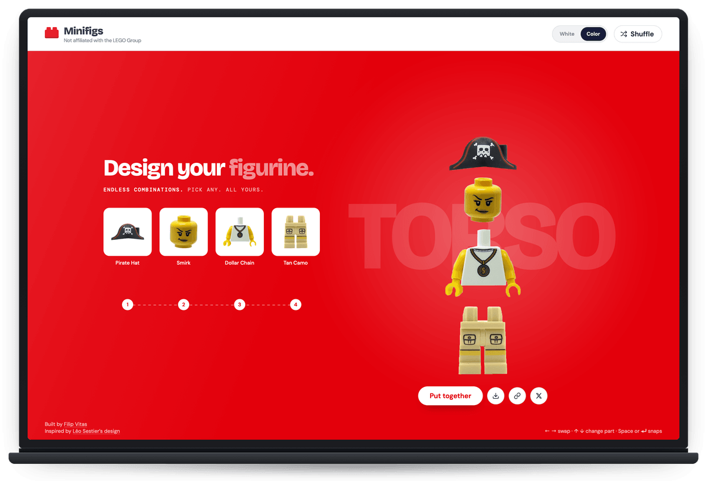
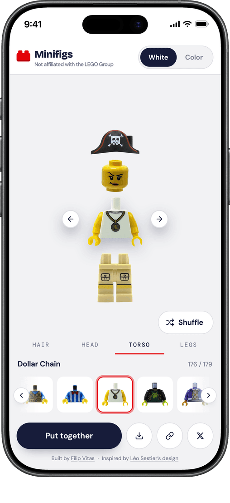

<div align="center">

# Minifigs

### Design your figurine.

Four slots. 389 real brick photographs. Over 50 million minifigures.<br>
Pick a hat, a face, a torso and a pair of legs, snap them together, take it home.

**[Open the studio →](https://minifigs-studio.vercel.app)**

<br>




</div>

<br>

## Build a figurine

**Swap anything.** Hair, hats and masks. Faces from a smirk to a scowl. Torsos, legs. Tap a part or arrow through it — the figure changes under your hands.

**Hit shuffle.** Out comes a knight in a tracksuit. Then a pirate in a lab coat. It never runs out.

**Pick your mood.** A clean white studio, or the full-colour version where the whole room takes the colour of whatever you are working on.

**In your pocket, too.** The whole studio, thumb-sized — same parts, same shuffle, one thumb.

**Take it with you.** Download your figure as a crisp transparent PNG, or copy the link — it carries the exact figure with it, so whoever opens it sees the one you built.

<br>

## Real bricks, real photos

Nothing here is drawn. Every hat, face, torso and pair of legs is a photograph of an actual piece, cut out and lined up so it sits on the figure exactly where it would sit on your desk. That is why the plastic looks like plastic.

<br>

## Run it yourself

```bash
pnpm install
pnpm dev
```

<br>

---

<div align="center">

Built by [Filip Vitas](https://x.com/vitasdev) · Inspired by [Léo Sestier's design](https://dribbble.com/shots/3722311) · [MIT licensed](LICENSE)

<sub>Not affiliated with, endorsed by, or sponsored by the LEGO Group.</sub>

</div>
